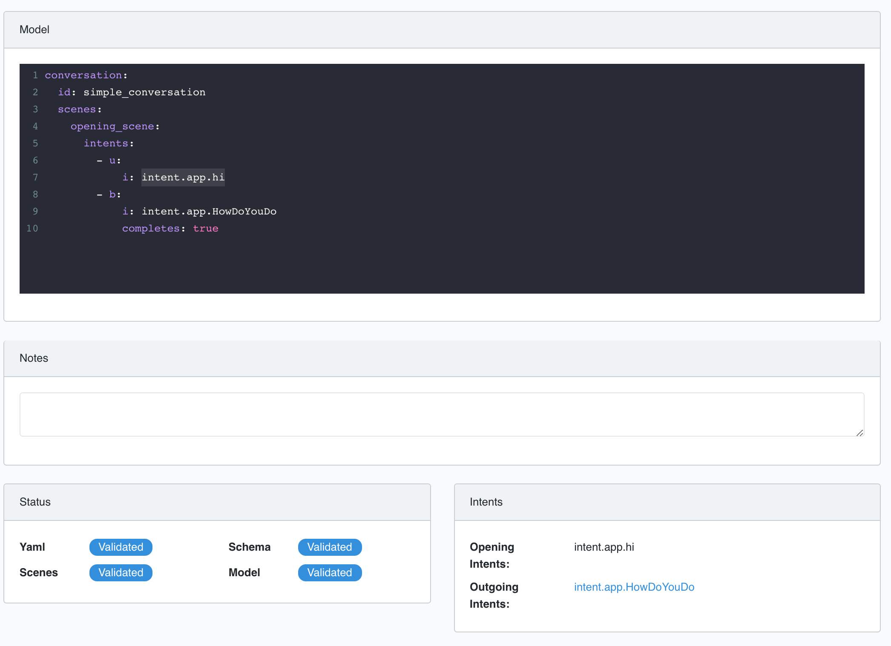
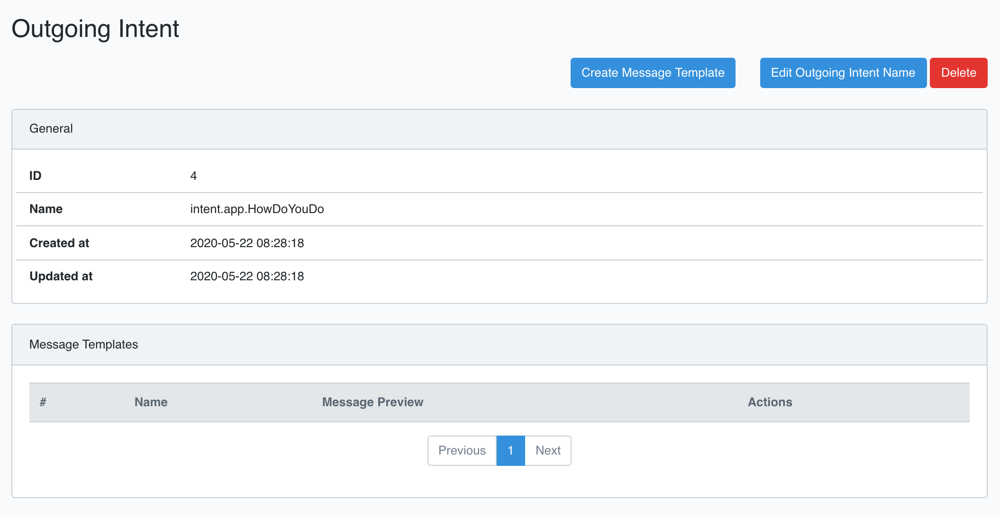
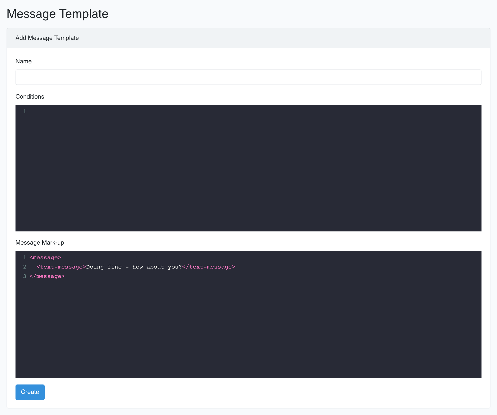
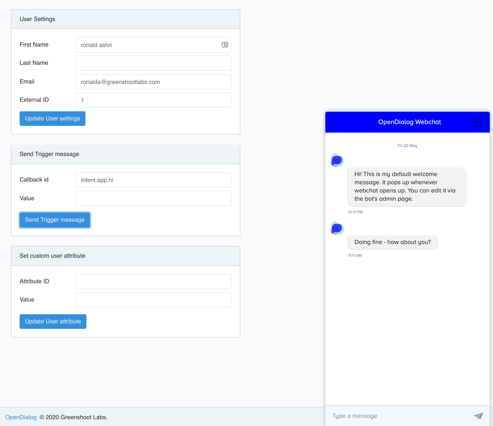
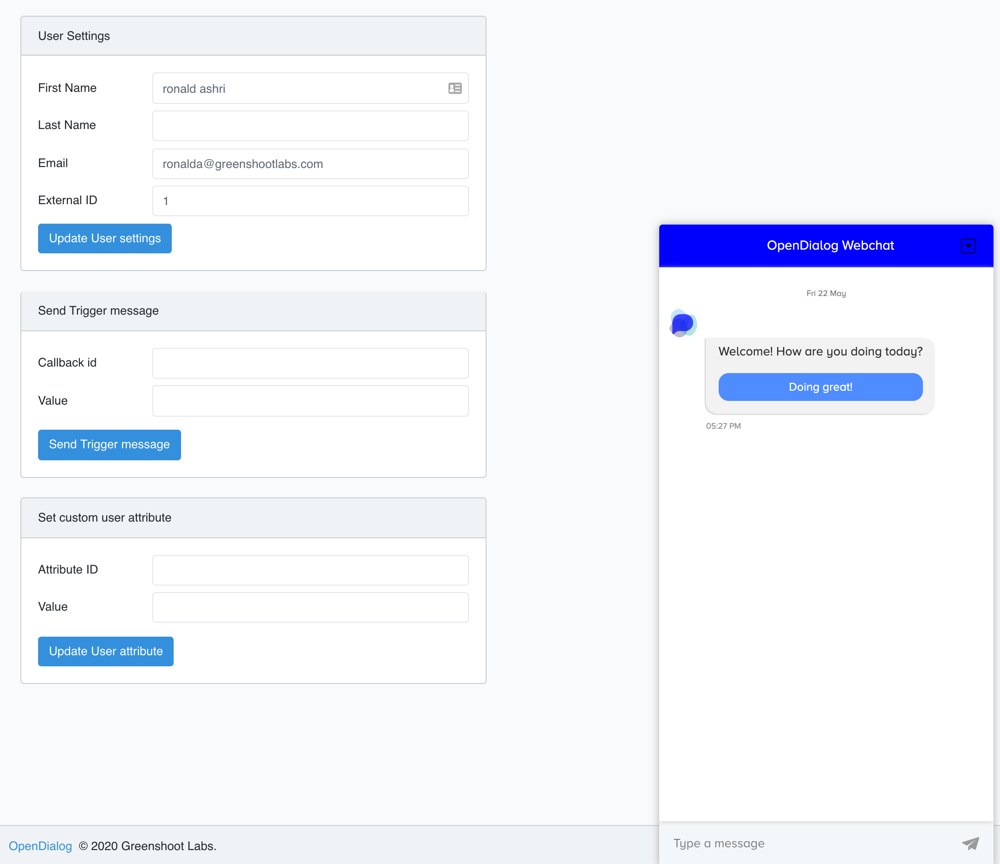
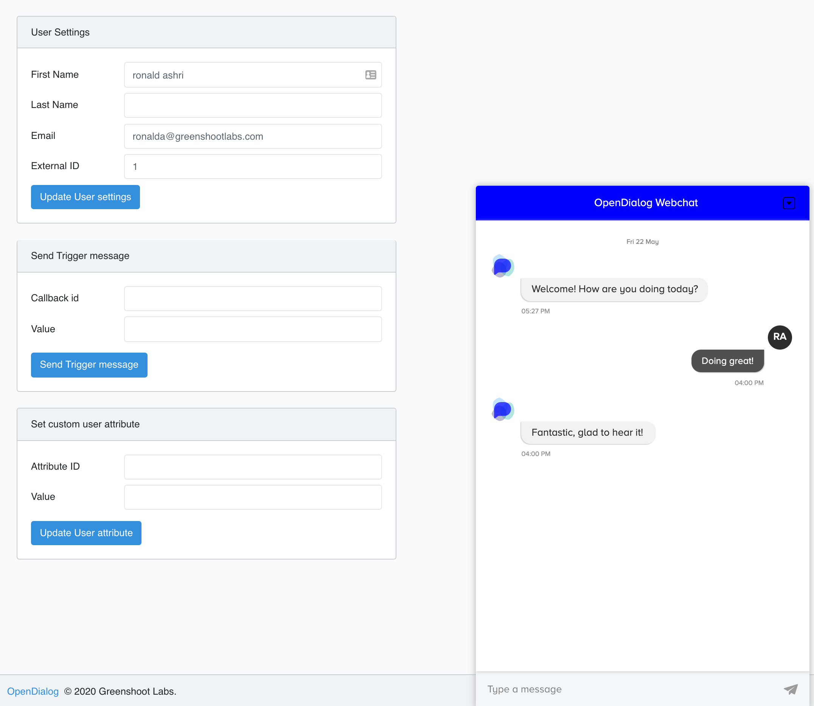
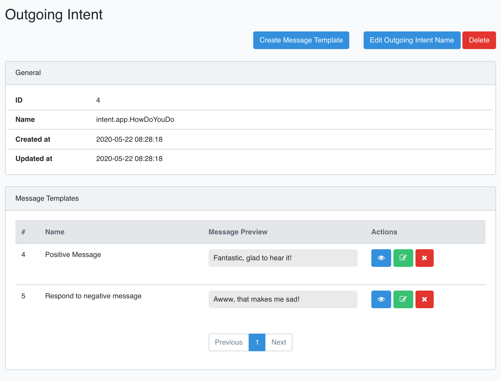
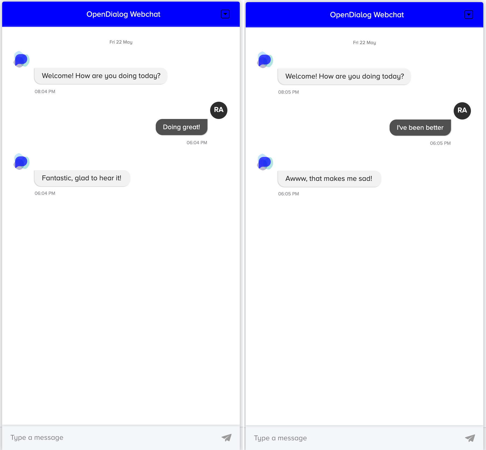
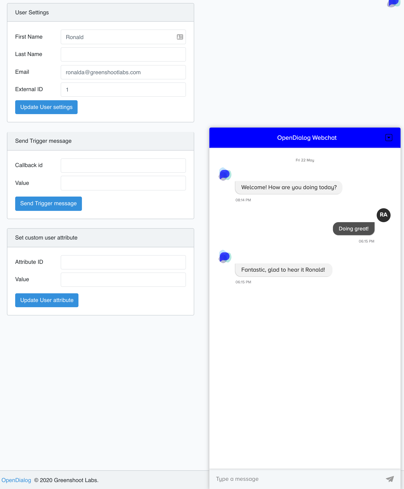

In the previous section about [creating a conversation](creating_a_conversation.md) we created a simple conversation with a request and response. Now, we are going to look at how we can associate messages to outgoing intents of that conversation. 

Let's start by taking another look at the conversation:

---


---

In the Intents section we have an opening intent and an outgoing intent. We want to associate this outgoing intent with a message. To do this we can click on the outgoing intent to create an outgoing intent in our message response engine that can be linked to messages.

---


---

Once the outgoing intent is created we can add message templates to it.

---


---

A message tempalte has a name, associated conditiosn and the message mark-up. We will deal with conditions later and for now just add the simplest type of message - a text message.


---


---

The message content is as follows:

```
<message>
  <text-message>Doing fine - how about you?</text-message>
</message>

```

Now, returning to the test page for the bot and entering the incoming intent from the user as a trigger we will receive the message we just created. 

---


---

## Messages with Buttons

Of course, so far things aren't that exciting. The conversation was triggered by explicitly sending a trigger throught the bot admin test page. 

We are now going to see how we can create a bit more of a conversational flow (albeit a button driven one), before we move on and start exploring interpreters that will allow us to interpret natural language. 

Let's modify an existing conversation to enable the user to click on a button to send a message to the bot that will trigger another conversation. The conversation we will modify is the default welcome conversation. 

```
conversation:
  id: welcome
  scenes:
    opening_scene:
      intents:
        - u:
            i: intent.core.welcome
        - b:
            i: intent.opendialog.WelcomeResponse
            completes: true
```    

The default welcome conversation waits for an an incoming intent called `intent.core.welcome` and replies with the `intent.opendialog.WelcomeResponse` outgoing intent. The `intent.core.welcome`, by default, is triggered by the event of the user opening the webchat widget. We will take advantage of this conversation and just add a button on the `intent.opendialog.WelcomeResponse` outgoing intent so that the user can react to that response. 

Since the intent remains the same we don't need to modify the actual conversation just the message associated with the outgoing intent. Go to the Message Editor, click on the WelcomeResponse outgoing intent and edit the Welcome message template, replacing it with the message below. 

```
<message>
	<button-message>
    	<text>Welcome! How are you doing today?</text>
	   <button>
    	    <text>Doing great!</text>
        	<callback>intent.app.hi</callback>
	    </button>
  </button-message>
</message>
```

We are creating a `button-message` that has some text at the top and then can have one or more buttons associated with it. Each button has a callback and in this case the callback is the id of the incoming intent that will match the next conversation. What we are telling OpenDialog is that when the user clicks that button OpenDialog should behave as if the user intented to say `intent.app.hi`.

---


---

Now, if we go back to the test page we will see that the welcome message has the button we just added. 

---


---

Clicking on it will trigger the conversation with the opening intent that matches that callback. 

> Callbacks on buttons do not need to match the ids of incoming intents. If they do OpenDialog can handle them out of the box, if they don't you can provide mappings between callbacks and intents in OpenDialog configuration.

---


---

## Messages with conditions

Now, just to show how flows can start building in complexity and how we can use conditions in messages to help separate concerns, let's add another button that will allow the user to offer a different greeting. 

We will have a message with a positive hi and a negative hi and will respond appropriately based on the incoming intent.

Below is the message that corresponds to the `intent.opendialog.WelcomeResponse` outgoing intent. We now have two buttons, with differnt text and callback values. 

```
<message>
	<button-message>
    	<text>Welcome! How are you doing today?</text>
	   <button>
    	    <text>Doing great!</text>
        	<callback>intent.app.positiveHi</callback>
	    </button>
	   <button>
    	    <text>I've been better</text>
        	<callback>intent.app.negativeHi</callback>
	    </button>
  </button-message>
</message>
```

Next up, we want our conversation to pick up any one of those two intents and provide a response. As such, the conversation has two possible opening intents, one for a positive hi and one for a negative one.  

```
conversation:
  id: simple_conversation
  scenes:
    opening_scene:
      intents:
        - u:
            i: intent.app.positiveHi
        - u:
            i: intent.app.negativeHi
        - b:
            i: intent.app.HowDoYouDo
            completes: true
```    

The outgoing intent, however, remains the same but we are going to give our outgoing intent message two message templates, and we are going to add conditions to those messages so that the appropriate one is selected based on what the user said. 

> There are multiple ways of "solving" this conversational problem. We could have used different conversations for each intent, we could have placed conditions on outgoing intents instead of the messages, we could have used multiple scenes, etc. For now, the purpose is to highlight the use of conditions on messages. Ultimately, you can pick the most appropriate solution based on what else is going on and how will be managing different parts of the application. 

The outgoing intent now looks like this:

---


---

There are two message templates, one for each type of response. Withing the message templates themselves we've added conditions. 

---


---

```
conditions:
  - condition:
      operation: eq
      attributes:
        attribute: conversation.interpreted_intent
      parameters:
        value: intent.app.positiveHi
```
The condition takes advantage of the conversation context, and checks if the `interpreted_intent`is equal to `intent.app.positiveHi` (or `intent.aoo.negativehi` for the other message).

---


---

## Using attributes in messages

Finally, let's look at how we can use attributes in messages to personalise them further. 

We will add the user's first name as an attribute in the positive message. 

```
<message>
  <text-message>Fantastic, glad to hear it {user.first_name}!</text-message>
</message>
```

The result when we test it is:

---


---


## Different message types

In the examples above we've used plain text messages and messages with buttons. OpenDialog supports a wide range of message types and the [next section](message_markup.md) provides a comprehensive guide through them. 

