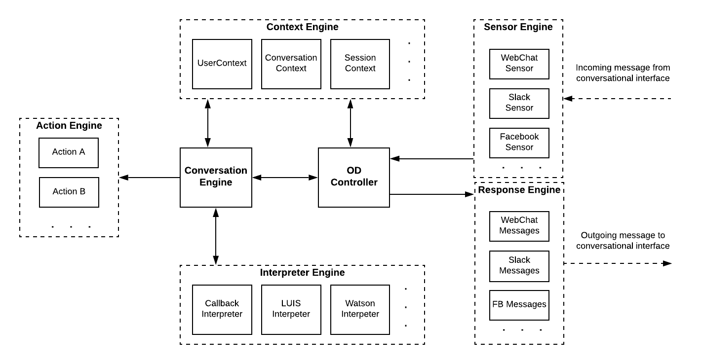

## OpenDialog for Developers

OpenDialog is a [Laravel](https://laravel.com) application with a MySQL backend for user management and content management and a [Dgraph](https://dgraph.com) backend (a graph-based database written in Go) for conversation management and conversational analytics. 

### Main Components

Below is a brief description of the main components of OpenDialog. 

- **Conversation Description Language** - this is a [Yaml-based markup format](conversation_markup.md) that we use to describe conversations. The aim is to make it as simple as possible to describe potentially complex conversations that can deal with changing context and variations in user input.

- **Conversation Builder** - the conversation builder transforms that Yaml-based markup into a graph-based representation of a conversation that is stored in a graph database - we use [Dgraph](https://dgraph.com). It also helps the user to design _sensible_ conversations. By analysing the conversation it can identify potential pitfalls and suggest changes. 

- **Conversation Engine** - the conversation engine "runs" our conversations. It's the heart of OpenDialog. It determines, based on incoming utterances and overall state, what the next actions and outgoing messages should be.

- **Action Engine** - the action engine performs actions defined within conversations. It interfaces with the conversation engine and the context engine to update context and allow conversations to proceed taking into account the results of actions. Actions are the main way our conversational applications interface with external systems.

- **Context Engine** - the context engine keeps track of state. Through attributes we can store and retrieve information that is relevant to determining what actions and what messages we should perform. 

- **Response Engine** - the Response Engine takes an _outgoing intent_ (in OpenDialog terminology this represents something the bot wants to say) and maps it to an actual message. The final message may change based on the channel it will be sent to and overall context.

- **Sensor Engine** - the Sensor Engine receives incoming messages and maps them to OpenDialog standard utterances and attributes and prepares them for consumption by the Conversation Engine. It is designed in a way that we can deal with multiple platforms (webchat, Slack, Alexa, etc).

- **Webchat Widget** - the Webchat Widget is a widget you can add to any website or web application and interact with an OpenDialog-powered chatbot. It provides a number of different message types and has a simple API to interact with as well as a rich set of configuration options. 

### The OD Lifecycle

_This is a simplified view of the activities that take place from user input to bot response to give you a sense of how OpenDialog works._

It all starts with an incoming message at one of the OpenDialog sensors. 

#### Receive message
Each sensor deals with a specific conversational interface platform and converts that message to an OpenDialog Utterance. Sensors listen at a specific endpoint (for webchat that is `incoming\webchat`) and deal with any platform specific authentication/authorisation/validation issues. 

#### Convert to Utterance
The SensorEngine then converts that message to an Utterance that OpenDialog can understand. An Utterance represents what the user said (or did) and also carries relevant contextual information about the platform that originated that utterance. The Utterance is passed to the OpenDialog Controller that orchestrates overall activity from this point onwards. 

#### Determine what to reply

The OpenDialog Controller will pass the utterance on the ConversationEngine that will determine:
- the intent of the Utterance and whether there are any attributes contained within the utterance that we should store. To determine intent, the ConversationEngine sends the intent to an IntentInterpreter. There is a default interpeter and every incoming utterance on a conversation can define its own interpreter. 
- what a suitable outgoing intent would be based on the overall state of the conversation. A user can be in one of two states with regards to conversations:
  - they are in an ongoing conversation. In this case we attempt to determine what the appropriate response would be for that conversational context. If a suitable response is not found we will exit that conversational context and look at all possible conversations for a response.  
  - they are not in an ongoing conversation. In this case we are looking to initiate a conversation. 
- perform any actions associated with the incoming intent or (once it is determined) with the outgoing intent. 

#### Determine how to reply

Once we have identified with what outgoing intent we should reply we match that intent to an actual message that is able to achieve the required intent. The ResponseEngine does the work of matching the outgoing intent to an actual message. 

